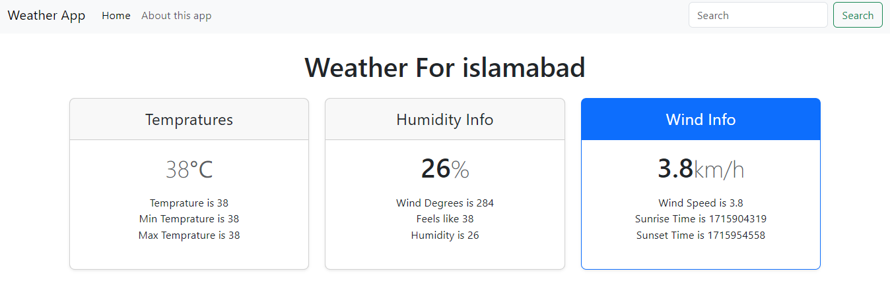
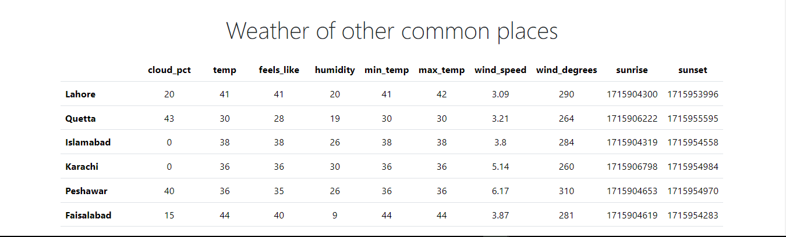

# Weather App

## Overview

This is a simple weather web application that allows users to check the current weather conditions for a specific city and view weather data for common cities. The application utilizes the [Weather By API Ninjas](https://rapidapi.com/user/api-ninjas) API to fetch weather data.

## Features

- **Current Weather:** Users can enter a city name and click the "Search" button to view the current weather conditions for that city.
- **Weather for Common Cities:** The application also displays weather data for common cities such as Lahore, Quetta, Islamabad, Karachi, Peshawar, and Faisalabad.
- **Responsive Design:** The application is built with responsive design principles, ensuring a seamless experience across various devices.

## Technologies Used

- HTML
- CSS (Bootstrap framework)
- JavaScript

## Usage

1. Clone the repository to your local machine.
2. Open the `index.html` file in your web browser.
3. Enter a city name in the search input field and click the "Search" button to view the current weather conditions for that city.
4. Alternatively, view weather data for common cities displayed on the page.

## Screenshots

## Credits

- [Weather By API Ninjas](https://rapidapi.com/user/api-ninjas) for providing the weather data API.

